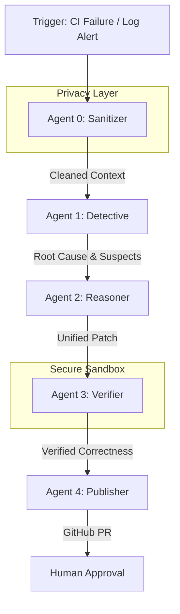

# NeverDown: Autonomous DevOps & Incident Remediation 🚀

**The first AI-native system that detects, analyzes, and patches CI/CD failures before you even see the alert.**

[](https://opensource.org/licenses/MIT)
[](https://www.python.org/downloads/release/python-3110/)
[](https://www.docker.com/)

---

## 💡 Why NeverDown?

Modern engineering teams spend **30-40% of their time** debugging CI/CD failures, flaky tests, and environment mismatches. NeverDown turns this reactive toil into a proactive background process.

### The Problem
- **Alert Fatigue**: Developers are bombarded with "Build Failed" notifications.
- **Context Switching**: Dropping a feature task to fix a typo in `postcss.config.mjs` kills velocity.
- **Security Risks**: Debugging often involves sharing raw logs that might contain leaked secrets.

### The NeverDown Solution
1. **Detect**: Listen to GitHub Workflows and Monitoring hooks.
2. **Sanitize**: Automatically redact secrets and PII from logs before they touch an LLM.
3. **Reason**: Multi-agent LLM analysis to find the root cause and generate a surgical patch.
4. **Verify**: Run the fix in a secure, isolated Docker sandbox.
5. **Remediate**: Open a high-quality Pull Request with full context.

---

## 🏗️ Technical Architecture

NeverDown uses a sophisticated **5-Agent Autonomous Pipeline** designed for security and reliability.



### The Agentic Pipeline
| Agent | Role | Capabilities |
| :--- | :--- | :--- |
| **0. Sanitizer** | Privacy Guard | Redacts AWS, GitHub, Stripe keys, and high-entropy strings. |
| **1. Detective** | Forensics | Analyzes logs, git history (blame), and file relationships. |
| **2. Reasoner** | Engineer | Uses Claude-3.5-Sonnet/GPT-4o to generate surgical code fixes. |
| **3. Verifier** | QA | Runs fixes in isolated Docker containers with no network access. |
| **4. Publisher** | DevOps | Handles PR creation, branch management, and human-in-the-loop refinement. |

---

## 🔒 Security & Safety by Design

- **Zero-Cloud-Leak Policy**: Raw repository data and logs never leave your network without redaction.
- **Isolated Execution**: All verifications happen in `chroot`-like Docker sandboxes with strict resource limits.
- **Human-in-the-Loop**: NeverDown **never auto-merges**. It provides a "Request Changes" loop where the AI refines its fix based on your feedback.
- **Read-Only Production**: The system only interacts with your source control via PRs.

---

## 🚀 Getting Started

### Prerequisites
- Python 3.11+
- Docker (for sandbox verification)
- PostgreSQL (Neon, Supabase, or Local)

### Installation
```bash
# Clone the repository
git clone https://github.com/manik3160/NeverDown.git
cd NeverDown

# Install core and dev dependencies
pip install -e ".[dev]"

# Configure environment
cp .env.example .env
# Open .env and add your GITHUB_TOKEN, LLM_API_KEY, and DATABASE_URL
```

### Running Locally
```bash
# Start the backend API
python main.py

# Launch the Dashboard
cd web && npm run dev
```

---

## 📺 Dashboard Preview

NeverDown provides a high-fidelity dashboard to monitor your autonomous fleet. View live execution logs, AI reasoning steps, and patch previews in real-time.


---

## 📜 Development & Testing

We maintain a rigorous test suite for all agents.

```bash
# Run full suite
pytest

# Test specific agent
pytest tests/test_sanitizer.py
```

---

## 🤝 Contributing

NeverDown is built for the community. See [CONTRIBUTING.md](CONTRIBUTING.md) for details on how to add new agent capabilities or integrations.

---

## 📜 License
MIT © [NeverDown Team](LICENSE)
