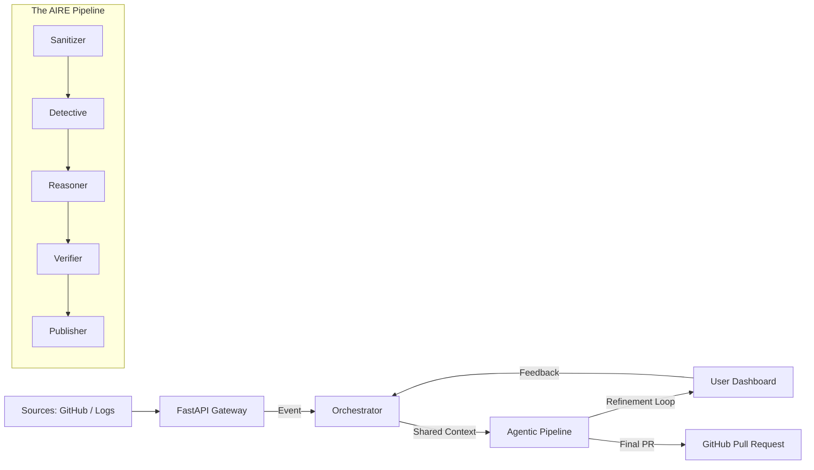

# NeverDown Architecture Overview 🏛️

**Autonomous Incident Remediation Engine (AIRE)**

NeverDown is built on an event-driven, agentic architecture that prioritizes **data privacy**, **isolated verification**, and **human-in-the-loop control**.

---

## 🏗️ High-Level Architecture

---

## 🤖 The Multi-Agent System

### 1. Agent 0: Sanitizer (Privacy First)
The Sanitizer is the gateway for all data entering the system. Its primary role is to ensure that NO secrets or PII are ever sent to external LLM providers.
- **Pattern Matching**: Scans for 15+ known API key formats.
- **Entropy Analysis**: Detects high-entropy strings that may be obfuscated secrets.
- **Shadow Repo**: Creates a temporary, sanitized clone of the target repository for subsequent agents to work on.

### 2. Agent 1: Detective (Context Extraction)
The Detective specializes in forensic analysis of the failure. It looks beyond the immediate error message.
- **Log Parsing**: Extracts structured error information (type, message, file, line) from raw build logs.
- **Git Integration**: Performs a `git blame` and history analysis to find recent commits that modified the failing lines.
- **Failure Categorization**: Groups failures into known types (Logic Error, Config Mismatch, Dependency Issue) to tailor the Reasoner's prompt.

### 3. Agent 2: Reasoner (Logic & Generation)
The Reasoner is the "brain" of NeverDown. It synthesizes the cleaned code and the Detective's findings to generate a fix.
- **Root Cause Analysis**: Explains *why* the failure happened.
- **Surgical Patching**: Generates a unified diff patch (`.patch` format) instead of rewriting entire files.
- **Confidence Scoring**: Assigns a score to the generated fix, allowing the system to halt if it's not confident.

### 4. Agent 3: Verifier (Closed-Loop Testing)
The Verifier ensures the proposed patch actually works before showing it to a human.
- **Docker Sandboxing**: Pushes the patch into a fresh, isolated Docker container.
- **No-Network Environment**: Prevents side effects or exfiltration during testing.
- **Automated Test Run**: Detects and runs relevant test suites (`pytest`, `jest`, `npm test`) to confirm the fix passes.

### 5. Agent 4: Publisher (Deployment & PR)
The Publisher handles the final delivery of the fix.
- **Branch Management**: Pushes the fix to a dedicated branch (e.g., `neverdown/fix-12345`).
- **PR Enrichment**: Generates a high-quality PR description including AI reasoning, suspected files, and sandbox verification results.
- **Refinement Loop**: Listens for user feedback. If a human clicks "Request Changes" and provides feedback, the Reasoner re-runs with the new context to update the PR.

---

## 💾 Data Persistence & Auditability

NeverDown uses **PostgreSQL** to maintain a source of truth for all incidents.
- **Incidents Table**: Stores the lifecycle of every remediation attempt.
- **Analyses Table**: Persists the raw reasoning and detective reports for human audit.
- **Audit Log**: Every state transition and agent execution is logged for transparency.

---

## 🛠️ Technology Stack

- **Backend**: FastAPI (Python 3.11)
- **Database**: PostgreSQL (SQLAlchemy + asyncpg)
- **Agents**: LangChain / Direct LLM integrations (Anthropic, OpenAI)
- **Sandbox**: Docker Engine
- **Frontend**: Next.js 14 + Tailwind CSS (App Router)
- **Persistence**: Neon / Supabase (Cloud Ready)
